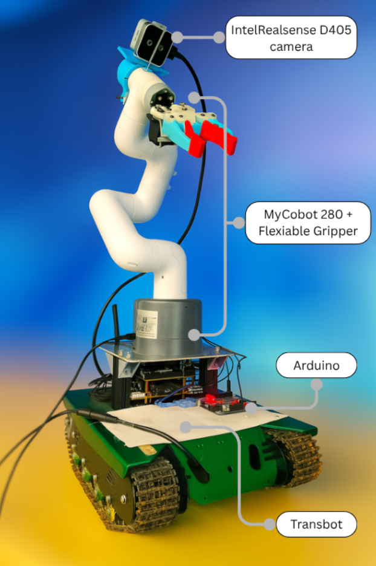
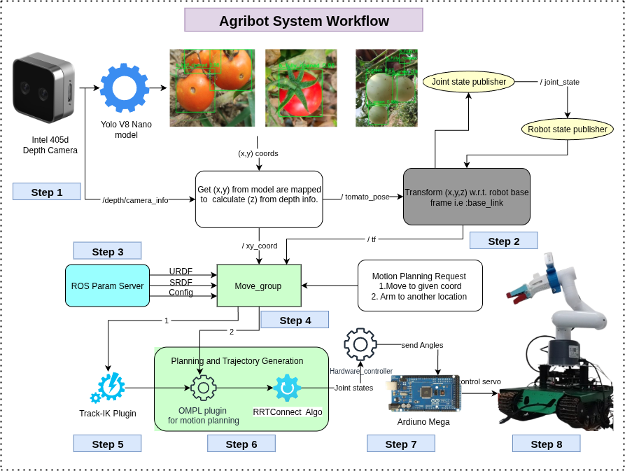

# Agribot: Vision-Guided Tomato Harvesting Robot  

[](http://wiki.ros.org/noetic)  
[](https://developer.nvidia.com/embedded/jetson-nano)  
[](https://github.com/ultralytics/ultralytics)  

<p align="center">

<br>
<em> Agribot </em>
</p>


> Affordable agricultural robot designed to automate tomato harvesting in small & medium-scale farms in India.  

---

## Overview  
Agribot is a **vision-guided autonomous harvesting robot**.  
It integrates a tracked mobile base, a 6-DOF robotic arm, and a flexible gripper with an ML-based perception pipeline to **detect, localize, and gently pluck ripe tomatoes**.  

---

## Features  
- **Tracked base** (Yahboom Transbot) for rough farm terrain.  
- **6-DOF robotic arm** (MyCobot 280 Arduino) with MoveIt planning.  
- **Stereo vision** (Intel RealSense D405) for 3D fruit localization.  
- **Tomato detection** with YOLOv8-nano trained on India-specific dataset.  
- **Custom flexible gripper** with torque-optimized design.  
- Runs fully **onboard Jetson Nano (9–11W)** with real-time inference.  

---

## Hardware  

- **Base**: Yahboom Transbot (tracked)  
- **Arm**: MyCobot 280 Arduino, 6-DOF  
- **Gripper**: Flexible silicon fingers + high-torque servo  
- **Camera**: Intel RealSense D405 RGB-D  
- **Compute**: NVIDIA Jetson Nano Dev Kit  
- **Power**: 12V Li-ion battery  

---

## Software  

- **OS**: Ubuntu 20.04 LTS  
- **Middleware**: ROS Noetic + MoveIt  
- **Perception**: YOLOv8-nano (PyTorch, Ultralytics), OpenCV, RealSense SDK  
- **Planning**: TRAC-IK solver + OMPL (RRT-Connect)  
- **Control**: Arduino IDE + ROS serial communication  
- **Dataset Annotation**: Label Studio+ Custom data set collected from local horticulture officers.

---

## System Workflow  

<p align="center">

<br>
<em> Agribot System Workflow </em>
</p>

1. **Target Detection:** YOLOv5 processes RGB-D data from Intel RealSense, detecting tomatoes and outputting (x, y, z) positions in the camera frame. 
2. **Coordinate Transformation:** 3D positions are converted to the robot base frame (`base_link`) via ROS TF and published to `tomato_pose`.  
3. **Robot Setup:** Load URDF (links/joints), SRDF (collision/joint groups), TRAC-IK, and planner configurations.  
4. **Control Initialization:** `move_group` interfaces with ROS parameters; `joint_state` and `robot_state_publisher` maintain real-time states.  
5. **Inverse Kinematics:** TRAC-IK computes joint angles with improved accuracy and joint-limit handling.  
6. **Motion Planning:** OMPL with RRT-Connect generates collision-free trajectories respecting joint and environmental constraints.  
7. **Execution:** Trajectories sent via `joint_states` to Arduino controller, converted into servo commands for precise arm motion.  
8. **Verification:** End-effector position is checked against the planned trajectory, monitoring collisions and joint limits.

**Avg harvest cycle**: 15–17 sec / tomato  

---

## Results  

- **Detection F1-Score**: 0.60 (ripe tomato detection)  
- **Harvest Time**: 15–17 sec per cycle  
- **Power Usage**: 9–11 W (Jetson Nano)  
- **Inference Latency**: ~0.13 ms  

## Installation
```bash
# from root of the workspace
mkdir -p agribot_ws/src && cd agribot_ws/src # Skip this if you already have a workspace

git clone https://github.com/FarmHelp-Robotics/agribot_src
rosdep install --from-paths src --ignore-src -r -y

# enjoy! :D
```
## 

## Test Video of Agribot 
Agribot plucking tomato in test bed

https://github.com/user-attachments/assets/05b39af2-fc81-404d-a115-3bdc4d79b47c


https://github.com/user-attachments/assets/148897a3-5d52-45b9-a57e-114927ce68bf


